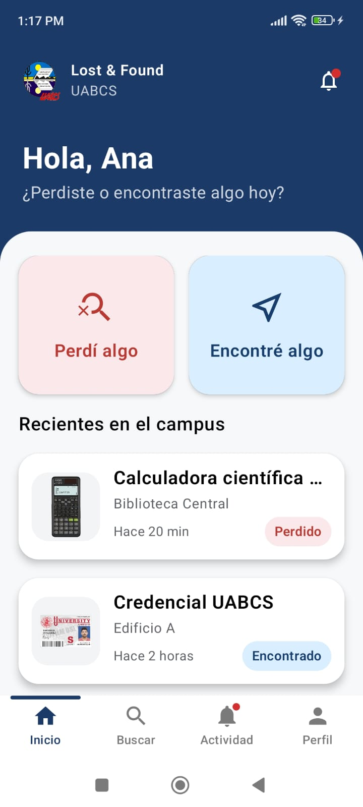
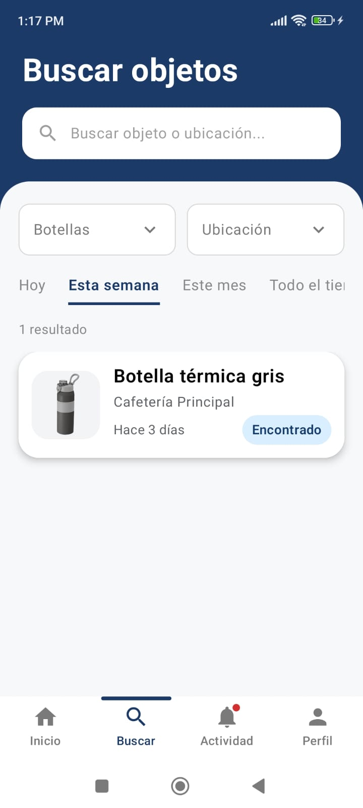
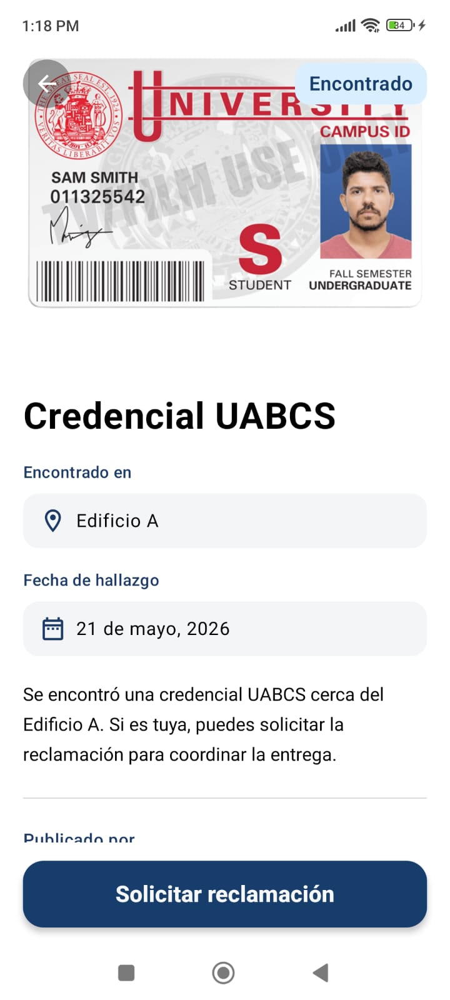
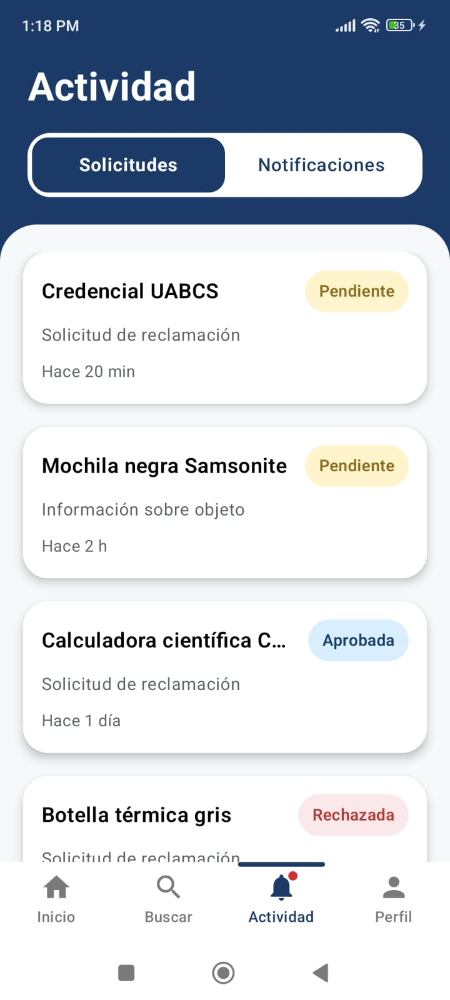
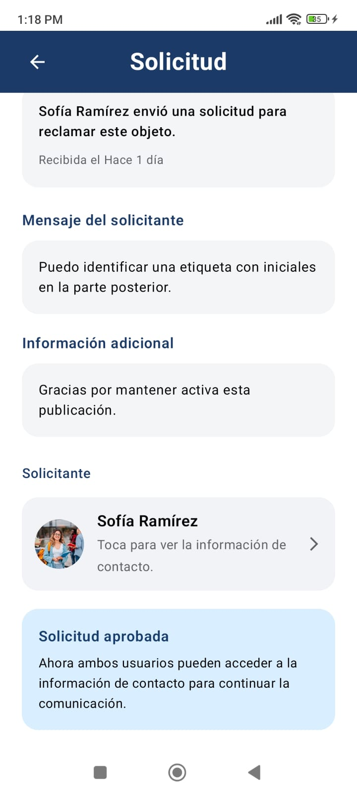
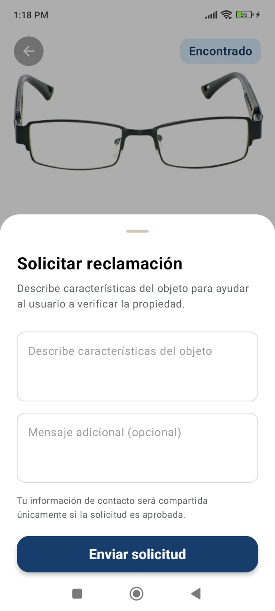

# Lost & Found UABCS

Academic mobile application designed to help university students report, search, and recover lost items within the campus community.

Originally developed as a full-stack solution using Laravel REST APIs and AWS S3 storage, this portfolio version was adapted with configurable mock data to preserve a fully navigable demonstration experience.

---

## Features

- Browse lost and found publications
- Search and filter reported items
- View publication details
- Submit ownership claims
- Review claim requests
- User profile and activity screens
- Offline portfolio demonstration support

---

## Tech Stack

- Kotlin
- Jetpack Compose
- Retrofit
- Laravel REST API (original implementation)
- AWS S3 (original implementation)

---

## APK

Download the latest Android version from the Releases section.

👉 https://github.com/cburgoin-dev/lost-and-found/releases/latest

---

## Screenshots

The screenshots below showcase the portfolio version of the application.

| Login | Home | Item Details |
|---|---|---|
|  |  |  |

| Activity | Profile | Claims |
|---|---|---|
|  |  |  |

---

## Notes

This repository contains the portfolio adaptation of the original academic project.

The original backend services are no longer publicly available. To preserve the user experience and allow recruiters and reviewers to explore the application, configurable mock data was introduced while maintaining the original navigation flows and functionality.
